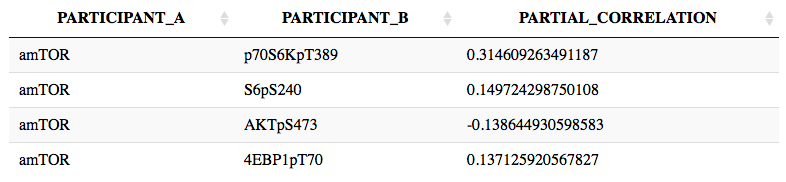
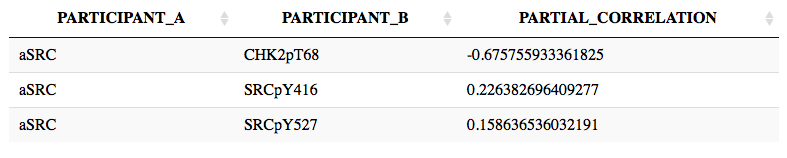
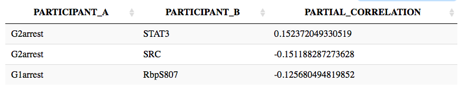

```{r knitrSetup, include=FALSE}
library(knitr)
opts_chunk$set(out.extra='style="display:block; margin: auto"', fig.align="center", fig.width=12, fig.height=12, tidy=TRUE)
```

# Purpose 
This interactive notebook shows how to visualize a network built from partial correlation analysis of a perturbation proteomic (RPPA here) dataset using only R.

# Load libraries
```{r,message=FALSE,warning=FALSE}
library(parcor)
library(fdrtool)
library(igraph)
``` 

# Load proteomic data
```{r}
nodes <- readRDS("melanoma_matrix_for_network_activitynodes.rds")
# conditions in rows, proteins/nodes in columns
nodes[1:5,1:5]
```

# Load node labeling data
```{r}
# nodes are protein nodes if labeled 1, phenotypic nodes if labeled 2, activity/drug coupling nodes if labeled 3
nodeType <- read.table("node_index.txt",stringsAsFactors = FALSE,
                       col.names = c("name","type"),colClasses = c("character","numeric"))
protNames <- nodeType$name[nodeType$type == 1]
phenoNames <- nodeType$name[nodeType$type == 2]
actNames <- nodeType$name[nodeType$type == 3]
protNames[1:5]
phenoNames
actNames
```

# Some explanations on the methods
For a given set of variables $X_i$, $i$ = 1,2,...,$p$, the partial correlation between $i$ and $j$ is estimated as $$\rho_{ij}=sign(\beta^i_j)\sqrt{\beta^i_j\beta^j_i}$$ $\beta$ is defined in the linear regression models $$X_i=\sum_{j\neq i} \beta^i_jX_j+\epsilon$$ where $\epsilon$ stands for i.i.d noise. The ridge.net method uses ridge regression as the regularized regression method to estimate $\beta$ in the $p \gg n$ ($p$: the number of variables, genes/proteins/elements, $n$: sample size, the number of observations/conditions) setting. The vector of regression coefficients are calculated as $$\beta^i=arg min \|X^i-X^{/i}\beta\|^2+\lambda\|\beta\|^2_2$$ where $X^i$ is the $i$th column of $X$ and $X^{/i}$ is the matrix obtained from $X$ by deleting the $i$th column. k-fold cross validation is used to select the penalty parameter $\lambda$. Default k is 10-fold. The authors tested datasets with 100 variables and sample sizes ranging from 25-200 in steps of 25. In general, the power increases as the sample size increases and decreases as the network density increases. The power and number of significant edges still increase at sample size 200 but have the tendency to plateau. Sample size of >=200 is recommended.

More information on this method see the following paper
N. Kraemer, J. Schaefer, A.-L. Boulesteix (2009) "Regularized Estimation of Large-Scale Gene Regulatory Networks using Gaussian Graphical Models", BMC Bioinformatics, 10:384
http://www.biomedcentral.com/1471-2105/10/384/

Different correlation methods can be used, including adalasso.net from "parcor" package, aracne.a, aracne.m, and clr from "parmigene" (Detailed explanation of all the methods see Senbabaoglu et al, 2016, S1F text)
http://journals.plos.org/ploscompbiol/article?id=10.1371/journal.pcbi.1004765#sec024

General concept about partial correlation see the following papers
https://repositori.upf.edu/bitstream/handle/10230/22202/Correlation%20analysis%20FYP%20UPF%20version%20(1).pdf;sequence=1
https://arxiv.org/pdf/1607.01367.pdf


# Run partial correlation analysis
```{r}
# use the first 20 rows and 20 columns for a test run
ridgenet_test <- ridge.net(nodes[1:20,1:20],
                      plot.it = FALSE, scale = TRUE, k = 10, verbose=FALSE)
# The result is a list with one element pcor, a symmetric square matrix of partial correlation values without colnames/rownames
# Use the node names (same order as the ridge.net input) as the colnames and rownames of the matrix
nodeNames <- colnames(nodes[1:20,1:20])
dimnames(ridgenet_test$pcor) <- list(nodeNames,nodeNames)
ridgenet_test$pcor[1:5,1:5]
#saveRDS(ridgenet_test$pcor,"ridgenet_nodes_results_test.RData")
# load the pre-calculated partial correlation matrix
ridgenet_actnode <- readRDS("ridgenet_nodes_results.RData")
# The numeric values of partial correlation might be different if running multiple times. This is due to random split into k-fold cross-validation and can be avoid by setting random seed.
```

# Select for statistically significant edges
```{r}
# After the partial correlation calculation, fdrtool is used to assign statistical significance of the edges.Edges are called if pass the large-scale false discovery rate multiple testing (fdr < 0.2), otherwise the partial correlation goes to 0. Fewer edges will be called if a more stringent cutoff is used. 
# Local FDR is used here (cutoff.method="locfdr")
# More information see https://doi.org/10.1186/1471-2105-9-303 and https://doi.org/10.1198/016214504000000089
fdrTest <- fdrtool(as.vector(ridgenet_actnode),statistic = "correlation",cutoff.method = "locfdr",
                   plot = FALSE, verbose = FALSE)
ridgenet_actnode[which(fdrTest$lfdr >= 0.2)] <- 0
# To test the stability of the partial correlation matrix due to randomness caused by cross-validation, five independent random ridge.net run were generated. For different fdr values ranging from 0.01 to 0.4, 80-90% of non-zero edges identified in a single run are identified in the intersection of five run. 
```

# Visualize network 
```{r, fig.width=10, fig.height=10}
# The adjacency matrix columns/rows follow this order: protein nodes, phenotypic nodes, drug coupling/activity nodes
# the number of each type of nodes are given here

# extract a three column edge table from correlation (adjacency) matrix (with top n interactions)
# if n is not sepcified or is bigger than the number of all non-zero edges, use all non-zero edges
# provide phenotypic nodes and activity nodes names
source("extractEdge.R")
ridge_edge <- extractEdge(ridgenet_actnode,n=150,phenoName=phenoNames,actName=actNames)

# plot the network using igraph
plotNetwork <- function(edge_list) {
  g <- graph.edgelist(as.matrix(edge_list[,1:2]), directed = FALSE)
  V(g)$type <- ifelse(V(g)$name%in%actNames, "drug","protein")
  V(g)$type[which(V(g)$name%in%phenoNames)] <- "pheno"
  E(g)$type <- ifelse(edge_list[,3]<0,"inhibit","activate")
  theme <- list(vertex.label.cex=0.8,
                vertex.label.color="black",
                vertex.size=7,
                edge.width=1,
                vertex.label.dist=0.9,
                vertex.color=c("pink","skyblue","lightgreen")
                [1+(V(g)$type!="drug")+(V(g)$type=="pheno")],
                edge.color=c("black","red")[1+(E(g)$type=="inhibit")],
                layout = layout_with_lgl)
  # igraph object plus plot theme
  #params <- c(list(x=g), theme)
  return(list(g=g,theme=theme))
}
ridge_params <- plotNetwork(ridge_edge)
params <- c(list(x=ridge_params$g), ridge_params$theme)
do.call(plot,params)

```

# Analysis of Generated Networks

## Network Interactions and Edge Weights 
```{r}
library("DT")
# interactive table
DT::datatable(ridge_edge,rownames = FALSE)
```

## known and unknown drug targets

mTOR inhibitor targets the phosphorylation of ribosomal protein S6 kinase beta-1 (70S6 kinase), S6, and translation initiation factor 4E-binding protein 1 (4EBP1). All are known downstream proteins of mTORC1. The phosphorylation of AKT is also a target probably due to feedback loop. 


SRC inhibitor targets phosophorylation of SRC protein. A new target identified in the network is Checkpoint kinase 2 involved in DNA repair in response to DNA damage. 


## Nodes Contributing to Phenotypes

Phosphorylated retinoblastoma protein is directly connected to G1 arrest phenotype, which is expected given RB is known to inhibit cell cycle progression. 
SRC and STAT3 contribute to G2 arrest. Both proteins are involved in signaling transductions that affect cell growth. However, it is likely that there are missing nodes in between SRC/STAT3 and G2 arrest phenotype that are not captured by this network.


## Paths From Drug to Phenotypes 
shortest path method for this part
```{r}
mTOR_G1 <- get.shortest.paths(ridge_params$g,"amTOR","G1arrest")$vpath[[1]]
mTOR_G1
```

