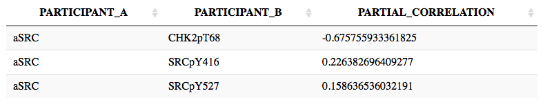
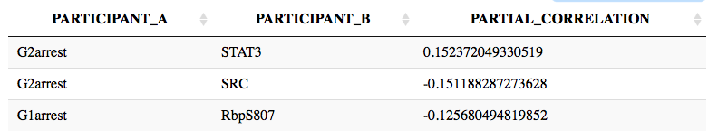

-   [Purpose](#purpose)
-   [Installation](#installation)
-   [Load libraries](#load-libraries)
-   [Load proteomic data](#load-proteomic-data)
-   [Load node labeling data](#load-node-labeling-data)
-   [Some explanations on the
    methods](#some-explanations-on-the-methods)
-   [Run partial correlation
    analysis](#run-partial-correlation-analysis)
-   [Select for statistically significant
    edges](#select-for-statistically-significant-edges)
-   [Visualize network](#visualize-network)
-   [Analysis of Generated Networks](#analysis-of-generated-networks)
    -   [Network Interactions and Edge
        Weights](#network-interactions-and-edge-weights)
    -   [known and unknown drug
        targets](#known-and-unknown-drug-targets)
    -   [Nodes Contributing to
        Phenotypes](#nodes-contributing-to-phenotypes)
    -   [Paths From Drug to Phenotypes](#paths-from-drug-to-phenotypes)

Purpose
=======

This interactive notebook shows how to visualize a network built from
partial correlation analysis of a perturbation proteomic (RPPA here)
dataset using only R.

Installation
============

``` r
options(repos = c(CRAN = "https://mran.microsoft.com/snapshot/2020-04-01"))

pkgs <- c("parcor", "fdrtool", "igraph")
install.packages(pkgs)
```

Load libraries
==============

``` r
library(parcor)
library(fdrtool)
library(igraph)
```

Load proteomic data
===================

``` r
nodes <- readRDS("melanoma_matrix_for_network_activitynodes.rds")
# conditions in rows, proteins/nodes in columns
nodes[1:5, 1:5]
```

    ##                4EBP1pS65 RbpS807 MAPKpT202 MEKpS217     S6
    ## 901|1.5           -0.435  -0.608    -0.855   -0.712 -0.113
    ## 901|1.5,HN|6      -0.308  -0.322    -0.999   -0.594  0.022
    ## 901|1.5,NT|3      -0.402  -0.549    -0.837   -0.675 -0.011
    ## 901|1.5,P6|20     -0.475  -0.652    -0.935   -0.751 -0.085
    ## 901|1.5,PLX|60    -0.611  -1.097    -1.234   -0.928 -0.114

Load node labeling data
=======================

``` r
# nodes are protein nodes if labeled 1, phenotypic nodes if labeled 2,
# activity/drug coupling nodes if labeled 3
nodeType <- read.table("node_index.txt", stringsAsFactors = FALSE, col.names = c("name", 
    "type"), colClasses = c("character", "numeric"))
protNames <- nodeType$name[nodeType$type == 1]
phenoNames <- nodeType$name[nodeType$type == 2]
actNames <- nodeType$name[nodeType$type == 3]
protNames[1:5]
```

    ## [1] "4EBP1pS65" "RbpS807"   "MAPKpT202" "MEKpS217"  "S6"

``` r
phenoNames
```

    ## [1] "G2M"      "G1arrest" "G2arrest" "Sarrest"  "cellviab"

``` r
actNames
```

    ##  [1] "aMEK"   "aAKT"   "aHDAC"  "aMDM2"  "aJAK"   "aBRAFm" "aPKC"   "aSTAT3"
    ##  [9] "amTOR"  "aPI3K"  "aCDK4"  "aSRC"

Some explanations on the methods
================================

For a given set of variables *X*<sub>*i*</sub>, *i* = 1,2,…,*p*, the
partial correlation between *i* and *j* is estimated as
$$\\rho\_{ij}=sign(\\beta^i_j)\\sqrt{\\beta^i_j\\beta^j_i}$$
*β* is defined in the linear regression models
*X*<sub>*i*</sub> = ∑<sub>*j* ≠ *i*</sub>*β*<sub>*j*</sub><sup>*i*</sup>*X*<sub>*j*</sub> + *ϵ*
where *ϵ* stands for i.i.d noise. The ridge.net method uses ridge
regression as the regularized regression method to estimate *β* in the
*p* ≫ *n* (*p*: the number of variables, genes/proteins/elements, *n*:
sample size, the number of observations/conditions) setting. The vector
of regression coefficients are calculated as
*β*<sup>*i*</sup> = *a**r**g**m**i**n*∥*X*<sup>*i*</sup> − *X*<sup>/*i*</sup>*β*∥<sup>2</sup> + *λ*∥*β*∥<sub>2</sub><sup>2</sup>
where *X*<sup>*i*</sup> is the *i*th column of *X* and
*X*<sup>/*i*</sup> is the matrix obtained from *X* by deleting the *i*th
column. k-fold cross validation is used to select the penalty parameter
*λ*. Default k is 10-fold. The authors tested datasets with 100
variables and sample sizes ranging from 25-200 in steps of 25. In
general, the power increases as the sample size increases and decreases
as the network density increases. The power and number of significant
edges still increase at sample size 200 but have the tendency to
plateau. Sample size of \>=200 is recommended.

More information on this method see the following paper N. Kraemer, J.
Schaefer, A.-L. Boulesteix (2009) “Regularized Estimation of Large-Scale
Gene Regulatory Networks using Gaussian Graphical Models”, BMC
Bioinformatics, 10:384 <http://www.biomedcentral.com/1471-2105/10/384/>

Different correlation methods can be used, including adalasso.net from
“parcor” package, aracne.a, aracne.m, and clr from “parmigene” (Detailed
explanation of all the methods see Senbabaoglu et al, 2016, S1F text)
<http://journals.plos.org/ploscompbiol/article?id=10.1371/journal.pcbi.1004765#sec024>

General concept about partial correlation see the following papers
<https://repositori.upf.edu/bitstream/handle/10230/22202/Correlation%20analysis%20FYP%20UPF%20version%20(1).pdf;sequence=1>
<https://arxiv.org/pdf/1607.01367.pdf>

Run partial correlation analysis
================================

``` r
# use the first 20 rows and 20 columns for a test run
ridgenet_test <- ridge.net(nodes[1:20, 1:20], plot.it = FALSE, scale = TRUE, k = 10, 
    verbose = FALSE)
```

    ## Performing local ridge regressions
    ## Vertex no 10 ...20 ...

``` r
# The result is a list with one element pcor, a symmetric square matrix of
# partial correlation values without colnames/rownames Use the node names (same
# order as the ridge.net input) as the colnames and rownames of the matrix
nodeNames <- colnames(nodes[1:20, 1:20])
dimnames(ridgenet_test$pcor) <- list(nodeNames, nodeNames)
ridgenet_test$pcor[1:5, 1:5]
```

    ##             4EBP1pS65   RbpS807  MAPKpT202    MEKpS217          S6
    ## 4EBP1pS65  1.00000000 0.1394210 0.01711621 -0.04243838  0.14802168
    ## RbpS807    0.13942100 1.0000000 0.16159258  0.13762871  0.02834800
    ## MAPKpT202  0.01711621 0.1615926 1.00000000  0.15450727  0.03565246
    ## MEKpS217  -0.04243838 0.1376287 0.15450727  1.00000000 -0.03893890
    ## S6         0.14802168 0.0283480 0.03565246 -0.03893890  1.00000000

``` r
# saveRDS(ridgenet_test$pcor,'ridgenet_nodes_results_test.RData') load the
# pre-calculated partial correlation matrix
ridgenet_actnode <- readRDS("ridgenet_nodes_results.RData")
# The numeric values of partial correlation might be different if running
# multiple times. This is due to random split into k-fold cross-validation and
# can be avoid by setting random seed.
```

Select for statistically significant edges
==========================================

``` r
# After the partial correlation calculation, fdrtool is used to assign
# statistical significance of the edges.Edges are called if pass the large-scale
# false discovery rate multiple testing (fdr < 0.2), otherwise the partial
# correlation goes to 0. Fewer edges will be called if a more stringent cutoff is
# used.  Local FDR is used here (cutoff.method='locfdr') More information see
# https://doi.org/10.1186/1471-2105-9-303 and
# https://doi.org/10.1198/016214504000000089
fdrTest <- fdrtool(as.vector(ridgenet_actnode), statistic = "correlation", cutoff.method = "locfdr", 
    plot = FALSE, verbose = FALSE)
ridgenet_actnode[which(fdrTest$lfdr >= 0.2)] <- 0
# To test the stability of the partial correlation matrix due to randomness
# caused by cross-validation, five independent random ridge.net run were
# generated. For different fdr values ranging from 0.01 to 0.4, 80-90% of
# non-zero edges identified in a single run are identified in the intersection of
# five run.
```

Visualize network
=================

``` r
# The adjacency matrix columns/rows follow this order: protein nodes, phenotypic
# nodes, drug coupling/activity nodes the number of each type of nodes are given
# here

# extract a three column edge table from correlation (adjacency) matrix (with top
# n interactions) if n is not specified or is bigger than the number of all
# non-zero edges, use all non-zero edges provide phenotypic nodes and activity
# nodes names
source("extractEdge.R")
ridge_edge <- extractEdge(ridgenet_actnode, n = 150, phenoName = phenoNames, actName = actNames)

# plot the network using igraph
plotNetwork <- function(edge_list) {
    g <- graph.edgelist(as.matrix(edge_list[, 1:2]), directed = FALSE)
    V(g)$type <- ifelse(V(g)$name %in% actNames, "drug", "protein")
    V(g)$type[which(V(g)$name %in% phenoNames)] <- "pheno"
    E(g)$type <- ifelse(edge_list[, 3] < 0, "inhibit", "activate")
    theme <- list(vertex.label.cex = 0.8, vertex.label.color = "black", vertex.size = 7, 
        edge.width = 1, vertex.color = c("pink", "skyblue", "lightgreen")[1 + (V(g)$type != 
            "drug") + (V(g)$type == "pheno")], edge.color = c("black", "red")[1 + 
            (E(g)$type == "inhibit")], layout = layout_with_lgl)
    
    # igraph object plus plot theme params <- c(list(x=g), theme)
    return(list(g = g, theme = theme))
}

ridge_params <- plotNetwork(ridge_edge)
params <- c(list(x = ridge_params$g), ridge_params$theme)
do.call(plot, params)
```


Analysis of Generated Networks
==============================

Network Interactions and Edge Weights
-------------------------------------

``` r
# library(DT) DT::datatable(ridge_edge, rownames = FALSE)
ridge_edge
```

    ##     PARTICIPANT_A PARTICIPANT_B PARTIAL_CORRELATION FDR_VAL
    ## 2            aSRC      CHK2pT68  -0.675755933361825    <NA>
    ## 4         S6pS240       S6pS235   0.428378826573724    <NA>
    ## 6           aMDM2           p53  -0.337216336901885    <NA>
    ## 8            aMEK           BIM  -0.327803005686608    <NA>
    ## 10          amTOR   p70S6KpT389   0.314609263491187    <NA>
    ## 12         aBRAFm      MEKpS217   0.293856241273955    <NA>
    ## 14           aMEK     MAPKpT202   0.278583198987272    <NA>
    ## 16           aJAK    STAT3pY705   0.275415685462328    <NA>
    ## 18          RAD51           p53   0.271610559558504    <NA>
    ## 20        ACCpS79     AMPKpT172   0.260864575577781    <NA>
    ## 22           aAKT      AKTpT308    0.25979290826314    <NA>
    ## 24           PKCa          PCNA   0.246636081692509    <NA>
    ## 26            SRC          ACC1   0.239732933917525    <NA>
    ## 28          aPI3K      AKTpS473   0.237277391716644    <NA>
    ## 30          c-Myc   p70S6KpT389   0.233955111149814    <NA>
    ## 32           aSRC      SRCpY416   0.226382696409277    <NA>
    ## 34            SRC        GSK3ab  -0.224395198960837    <NA>
    ## 36      c-JUNpS73         c-Myc    0.22401135534281    <NA>
    ## 38          RAD51    STAT6pY641  -0.222269277548988    <NA>
    ## 40     TSC2pT1462    GSK3abpS21   0.218841826439642    <NA>
    ## 42            SRC     PDK1pS241   0.216147897475559    <NA>
    ## 44            SRC          PCNA  -0.210900008517386    <NA>
    ## 46          aMDM2      YAPpS127  -0.198918504626368    <NA>
    ## 48     SMAD3pS423         SMAD3   0.196275941663412    <NA>
    ## 50            AKT      AKTpT308  -0.194635027203918    <NA>
    ## 52            SRC           BIM   0.193185748839316    <NA>
    ## 54    Collagenase          PCNA   0.190628455974031    <NA>
    ## 56           aPKC        GSKpS9   0.190398959954592    <NA>
    ## 58         aSTAT3          BCL2  -0.187261275330659    <NA>
    ## 60            SRC     AMPKpT172  -0.186443961769216    <NA>
    ## 62            SRC         c-Myc   0.181279521446124    <NA>
    ## 64            AKT     AMPKpT172   0.181079098245602    <NA>
    ## 66          aCDK4       ACCpS79  -0.178860680950007    <NA>
    ## 68            p21         STAT3   0.176331827045375    <NA>
    ## 70      4EBP1pT70        GSK3ab   0.176221306153443    <NA>
    ## 72          RAD51     4EBP1pT37   0.174449026392305    <NA>
    ## 74     STAT5pY694          IRS1    0.17430060611115    <NA>
    ## 76        PI3Kp85        IGFBP2  -0.174065675365074    <NA>
    ## 78       CyclinE1      AKTpS473   0.171144972602474    <NA>
    ## 80          RAD51         cRAFV   0.170545467121028    <NA>
    ## 82          c-Myc      CyclinD1    0.16987500997764    <NA>
    ## 84            SRC         EGFRV   0.167097863601977    <NA>
    ## 86       AKTpT308      AKTpS473   0.166716847218322    <NA>
    ## 88        S6pS240         c-Myc  -0.165326428104283    <NA>
    ## 90          aPI3K     c-JUNpS73  -0.165073210790223    <NA>
    ## 92         aSTAT3   Fibronectin   0.164921340337107    <NA>
    ## 94          RAD51         c-Myc  -0.164525113635315    <NA>
    ## 96         aSTAT3          PKCa  -0.164286739321636    <NA>
    ## 98           COX2         c-Myc  -0.164023756045111    <NA>
    ## 100       S6pS235    STAT5pY694   -0.16289324267385    <NA>
    ## 102         RAD51         STAT3   -0.16208975481774    <NA>
    ## 104      CyclinE1      YAPpS127   -0.16153510227963    <NA>
    ## 106        aSTAT3          PCNA   0.160904903106336    <NA>
    ## 108          PLK1      CyclinB1   0.159935974164823    <NA>
    ## 110          aSRC      SRCpY527   0.158636536032191    <NA>
    ## 112      CyclinE1      CyclinD1   0.158173690298038    <NA>
    ## 114        GSKpS9    GSK3abpS21     0.1576275183303    <NA>
    ## 116        aBRAFm     MAPKpT202    0.15748436952224    <NA>
    ## 118         RAD51          BCL2   0.157467826379953    <NA>
    ## 120     ELK1pS383     a-tubulin   -0.15737029556345    <NA>
    ## 122         RAD51         GATA3   0.156742145462919    <NA>
    ## 124          aJAK      SRCpY416   -0.15670133728099    <NA>
    ## 126         c-Myc           p27  -0.156083720016275    <NA>
    ## 128         RAD51   p70S6KpT389   0.155972669941034    <NA>
    ## 130         aPI3K         c-Myc  -0.155397717823877    <NA>
    ## 132         c-Myc         PAI-1   0.155329196543616    <NA>
    ## 134        aBRAFm      CHK2pT68   0.154697513912099    <NA>
    ## 136          PCNA      p38pT180   0.152929428714676    <NA>
    ## 138      G2arrest         STAT3   0.152372049330519    <NA>
    ## 140       ACCpS79    TSC2pT1462  -0.151619306895354    <NA>
    ## 142         aMDM2      CyclinD1  -0.151589877852627    <NA>
    ## 144           SRC    STAT5pY694   0.151361523144261    <NA>
    ## 146           SRC      CyclinD1  -0.151328044059299    <NA>
    ## 148      G2arrest           SRC  -0.151188287273628    <NA>
    ## 150   Fibronectin   p70S6KpT389  -0.150524946088843    <NA>
    ## 152         GATA3         EGFRV   0.150487958153808    <NA>
    ## 154         amTOR       S6pS240   0.149724298750108    <NA>
    ## 156      CHK2pT68      CyclinB1  -0.149273074342642    <NA>
    ## 158      CyclinE1         PAI-1    0.14915030063603    <NA>
    ## 160         aMDM2           SRC  -0.148158550573281    <NA>
    ## 162         aPI3K       ACCpS79    0.14806003992505    <NA>
    ## 164          PCNA      SRCpY527  -0.146927741026329    <NA>
    ## 166       PI3Kp85   b-CateninpS   0.146818295388843    <NA>
    ## 168         aCDK4      SRCpY527  -0.146816412825404    <NA>
    ## 170         RAD51       RbpS807    0.14580524998765    <NA>
    ## 172      CyclinD1       RbpS807    0.14552516323257    <NA>
    ## 174         RAD51      Caveolin   0.144054873509407    <NA>
    ## 176           SRC      p38pT180  -0.143934666007368    <NA>
    ## 178       ACCpS79    IGF1R-beta  -0.142568256329616    <NA>
    ## 180          aJAK     ELK1pS383  -0.142286320317345    <NA>
    ## 182      CyclinE1   p70S6KpT389   0.141941719246989    <NA>
    ## 184          aPKC   Fibronectin   0.141939039465478    <NA>
    ## 186        GSK3ab           BIM   0.141742725629179    <NA>
    ## 188    STAT5pY694      SRCpY527   0.141285680656834    <NA>
    ## 190     ELK1pS383      MEKpS217  -0.140731232434729    <NA>
    ## 192         RAD51          PKCa  -0.140436395555669    <NA>
    ## 194         amTOR      AKTpS473  -0.138644930598583    <NA>
    ## 196          aJAK     4EBP1pS65  -0.138567284481427    <NA>
    ## 198         aHDAC           p53   0.138013873625832    <NA>
    ## 200         amTOR     4EBP1pT70   0.137125920567827    <NA>
    ## 202         RAD51     CHK1pS345   0.136852749302971    <NA>
    ## 204         GATA3           BIM   0.136413123288176    <NA>
    ## 206        aSTAT3      SRCpY527     0.1364127841902    <NA>
    ## 208      CyclinD1           BIM  -0.136018819658063    <NA>
    ## 210          aPKC           BIM   0.135865701153994    <NA>
    ## 212      CHK2pT68    STAT5pY694   0.135636808472213    <NA>
    ## 214           AKT     MAPKpT202   0.135534812076646    <NA>
    ## 216        GSK3ab         SMAD3   0.135239079163348    <NA>
    ## 218          aMEK      CHK2pT68   0.134327486875002    <NA>
    ## 220        aBRAFm           SRC  -0.133358610963657    <NA>
    ## 222         aMDM2    STAT5pY694   0.132709948955881    <NA>
    ## 224     4EBP1pT70         GATA3  -0.131950184410495    <NA>
    ## 226           SRC           BAK   0.131873222865703    <NA>
    ## 228           SRC        IGFBP2  -0.131679396309157    <NA>
    ## 230           AKT      AKTpS473  -0.131393552446344    <NA>
    ## 232        aSTAT3     a-tubulin   0.131200212135851    <NA>
    ## 234          aMEK           p53  -0.131055179544672    <NA>
    ## 236          aJAK           p21  -0.130741711397177    <NA>
    ## 238        aSTAT3          COX2    0.13051603937049    <NA>
    ## 240    GSK3abpS21      AKTpS473   0.130400107376406    <NA>
    ## 242    STAT6pY641    STAT5pY694   0.129765332277115    <NA>
    ## 244           ERa      Caspase9   0.129593612220278    <NA>
    ## 246          aMEK         GATA3   0.129560216921035    <NA>
    ## 248     PDK1pS241      Caspase9  -0.129435874914941    <NA>
    ## 250          bRAF      YAPpS127   0.128820603443148    <NA>
    ## 252          PKCa           BIM   -0.12859442811177    <NA>
    ## 254         aCDK4    SMAD3pS423   0.128491358362787    <NA>
    ## 256         c-Myc    TSC2pT1462   -0.12787355422971    <NA>
    ## 258          PCNA       TAZpS89   0.127838224757783    <NA>
    ## 260          PCNA          PAX2   0.127694017441334    <NA>
    ## 262      CHK2pT68      SRCpY527    0.12765656667801    <NA>
    ## 264         aCDK4    STAT5pY694  -0.127134101226572    <NA>
    ## 266    TSC2pT1462      p38pT180   0.125736952827364    <NA>
    ## 268      G1arrest       RbpS807  -0.125680494819852    <NA>
    ## 270          PLK1         STAT5  -0.125599848914955    <NA>
    ## 272        BCL-XL      Caveolin   0.125510679597702    <NA>
    ## 274         RAD51      CyclinD1   0.125438899433889    <NA>
    ## 276          PCNA         c-Myc   0.124946395868844    <NA>
    ## 278      CyclinE1          ACC1   0.124908936160535    <NA>
    ## 280      CyclinE1          PLK1    -0.1247141833079    <NA>
    ## 282           p21          PLK1   0.124169865957718    <NA>
    ## 284        GSK3ab      YAPpS127     0.1241613822375    <NA>
    ## 286         aMDM2     b-Catenin    0.12387526596663    <NA>
    ## 288         aMDM2         c-Myc   0.123868648011579    <NA>
    ## 290       ACCpS79      CyclinD1  -0.123834814461964    <NA>
    ## 292          aJAK       PI3Kp85   0.123760398433702    <NA>
    ## 294        BCL-XL      Caspase9   0.123747594126807    <NA>
    ## 296      AKTpT308        GSKpS9   0.123687904692919    <NA>
    ## 298          aJAK    STAT5pY694   0.123475041964156    <NA>
    ## 300          aPKC    GSK3abpS21  -0.123204517977567    <NA>

known and unknown drug targets
------------------------------

 mTOR inhibitor
targets the phosphorylation of ribosomal protein S6 kinase beta-1 (70S6
kinase), S6, and translation initiation factor 4E-binding protein 1
(4EBP1). All are known downstream proteins of mTORC1. The
phosphorylation of AKT is also a target probably due to feedback loop.

 SRC inhibitor targets
phosophorylation of SRC protein. A new target identified in the network
is Checkpoint kinase 2 involved in DNA repair in response to DNA damage.

Nodes Contributing to Phenotypes
--------------------------------

 Phosphorylated retinoblastoma
protein is directly connected to G1 arrest phenotype, which is expected
given RB is known to inhibit cell cycle progression. SRC and STAT3
contribute to G2 arrest. Both proteins are involved in signaling
transductions that affect cell growth. However, it is likely that there
are missing nodes in between SRC/STAT3 and G2 arrest phenotype that are
not captured by this network.

Paths From Drug to Phenotypes
-----------------------------

Get shortest path method between nodes

``` r
mTOR_G1 <- get.shortest.paths(ridge_params$g, "amTOR", "G1arrest")$vpath[[1]]
mTOR_G1
```

    ## + 5/85 vertices, named, from 6415508:
    ## [1] amTOR       p70S6KpT389 RAD51       RbpS807     G1arrest
